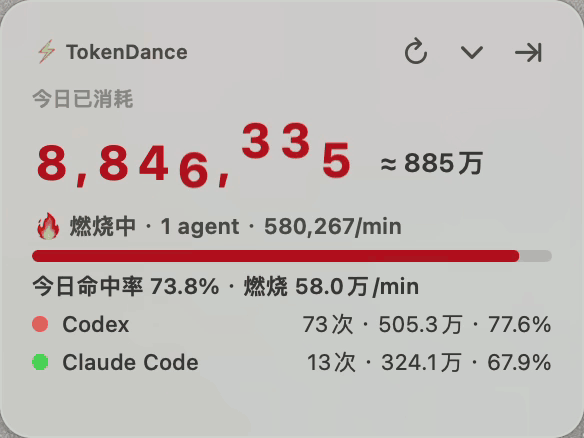
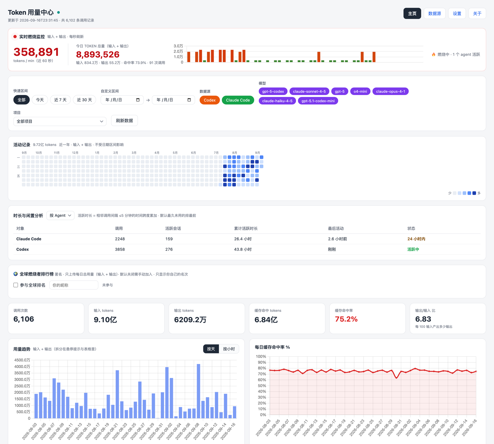
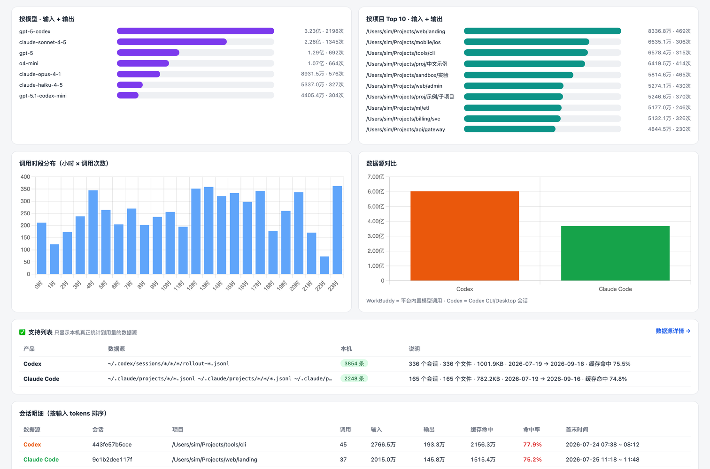
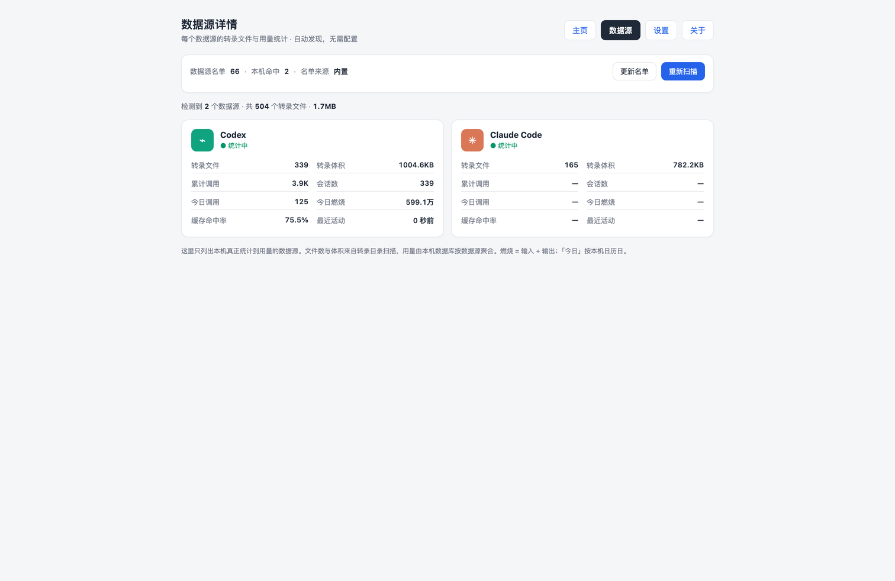

# TokenDance

*English · [中文](README.zh-CN.md)*

**A macOS menu-bar HUD for the token your AI coding agents burn** — Codex, Claude Code, and
whatever else you have installed. It watches the transcripts already on your disk, so the number
is live: today's total, the current burn rate, the cache hit rate, and which agent is doing it.

Everything is parsed and stored locally. No account, no login, no keys.

[](LICENSE)
[](https://github.com/philcui/tokendance/actions/workflows/ci.yml)




## What it does

- **A floating HUD in the menu bar**: today's total with a rolling odometer, live burn rate, cache
  hit rate, and a per-agent ranking. Draggable; collapses to the number alone; docks to the screen
  edge as a small ring.
- **A web dashboard** on `127.0.0.1:8737`: trends by day / source / project / model, a GitHub-style
  activity calendar, duration and idle analysis, a paged call log, and a page per data source.
- **Sources are discovered, not configured.** Known paths first, then a search by name, then a
  content scan of the standard locations. Anything that yields usage gets counted — including
  agents released after this app was.

## Why another one of these

There are several good token trackers now. Three things here are the reason this exists:

1. **Discovery instead of a list.** Other tools support a fixed set of agents and grow it by
   release. This one reads a registry that ships with the app *and* can be updated from the
   network, then searches by name, then scans for content. A tool nobody has heard of shows up on
   its own the first time you use it — that is how Goose was found while building this.
2. **A HUD, not a terminal command.** It answers "what am I burning right now", in the menu bar,
   without occupying a terminal or asking you to run anything.
3. **Local by construction.** The server binds `127.0.0.1` and writes SQLite in `~/.tokendance/`.
   There is no cloud component you have to trust; see *Network behaviour* for the complete list of
   outbound calls, which is four endpoints and nothing else.

## Install

**The easy way** — one line in Terminal (no browser, so no Gatekeeper dialog at all):

```bash
curl -fsSL https://fanshitou.cn/tokendance/install | sh
```

It reads the current version from the service, downloads the archive, checks the sha256, unpacks
it, installs to `/Applications`, clears the quarantine flag and launches. Read it first if you
prefer: `curl -fsSL https://fanshitou.cn/tokendance/install`.

**Or** open the `.dmg` from the release page and drag `TokenDance.app` into Applications — see
*If macOS refuses to open it* below, which that path will trigger. (The release page also has a
`.zip`; that one is what the in-app updater fetches.)

### If macOS refuses to open it

This build is **signed ad-hoc, not notarised**: it carries a signature, but not one Apple can trace
back to a developer. macOS therefore blocks the first launch — and it does so for **anything a
browser downloaded**, which sets the `com.apple.quarantine` flag on the file. The flag, not the
signature, is what triggers the check; the same binary runs fine without it.

Two ways past it, both verified on a real download:

```bash
# ① already dragged it into Applications — drop the "came from the internet" flag
xattr -dr com.apple.quarantine /Applications/TokenDance.app

# ② or fetch it from the command line instead, which never sets the flag at all
curl -fLO https://fanshitou.cn/tokendance/download/TokenDance-<version>.dmg
```

Right-click → *Open* also works on macOS 14 and earlier; on macOS 15 and later Apple removed that
shortcut and the equivalent is System Settings → Privacy & Security → *Open Anyway*, right after a
blocked attempt.

Worth knowing: **Homebrew does not help here.** A cask install sets the same quarantine flag on
what it unpacks (`com.apple.quarantine: …;Homebrew Cask;…`), so `brew install --cask` lands you at
the same dialog. Only a Developer ID signature plus notarisation removes it, and that is the one
thing this project does not have.

## Screenshots

The dashboard — live burn monitor, filters, and a year of activity:



Charts, per-model and per-project breakdowns, and which files on disk each number came from:



Every data source gets a page: what was detected, where it lives, how much it has produced:



## Supported agents

All parsing happens on your machine, and every parser ships with unit tests against synthetic
samples. Verified against real local data:

- **Codex** CLI and desktop · `~/.codex/sessions/**/rollout-*.jsonl`
- **Claude Code** · `~/.claude/projects/**/*.jsonl`
- **OpenCode** · `~/.local/share/opencode/opencode.db` (SQLite)
- **Antigravity** · `~/.gemini/antigravity/conversations/*.db`
- **WorkBuddy** · `~/.workbuddy/projects/**/*.jsonl`
- **Qwen Code** · `~/.qwen/tmp/*/chats/session-*.jsonl`

Integrated from each tool's own format, activates the moment data appears: **pi**, **Kimi Code**,
**iFlow**, **Qoder**, and **Goose** (found by the registry + content scan rather than by name).

Not supported, because the data isn't usable: Cursor (sparse token counts), Trae (SQLCipher-
encrypted), Windsurf, CodeBuddy CLI, 通义灵码 / 文心快码 (sessions live server-side).

## Build from source

Requirements: macOS 13+, Xcode command line tools (`swiftc`), Rust (`cargo`).

```bash
./scripts/build_app.sh          # → build/TokenDance.app  (compiles Swift + the Rust server, bundles both)
./scripts/package.sh            # → build/TokenDance-<version>-mac.zip   (what a release ships)
cd rust-server && cargo test    # 44 parser/store/API tests
```

The app carries the local server inside its bundle, so a built `.app` is self-contained:
no cargo, no node, no runtime to install on the target machine.

`package.sh` is not just a zip command: the archive's name and its internal layout are part of the
update protocol. The in-app updater downloads `TokenDance-<version>-mac.zip`, unpacks it and
expects `TokenDance.app` at the archive root, so the script builds the archive with `ditto`, unpacks
it again to prove the layout, and verifies the signature and the binary checksum before printing
the `sha256` that a release page wants. `--dmg` additionally produces a drag-to-Applications disk
image for humans; the updater only ever uses the zip.

## Network behaviour

This is the part people want to check, so here it is explicitly. With the default settings the
client talks to `https://fanshitou.cn/tokendance` and nowhere else:

No CDN, no fonts, no analytics snippet: the one third-party library the dashboard needs (chart.js
4.4.3, MIT) is vendored in `vendor/` and served by the local server as `/vendor/chart.umd.min.js`.
`scripts/privacy_check.sh` and `tools/dash/verify.mjs` both fail the build if any page ever starts
referencing an outside script again.

| When | Request | Carries |
|---|---|---|
| every 6 hours (on by default, one menu item turns it off) | `POST /api/ping` | a random install id (`u-` + 8 hex), app version, OS name and version, CPU architecture, UI language / theme, uptime in seconds |
| on launch and every 6 hours | `GET /api/version?ver=<current>` | the app version, so the service can answer "is there a newer release" |
| only if you opt in to the leaderboard | `POST /api/lb/submit`, `GET /api/lb/me?uid=…&days=…` | your display name and **daily totals** — never per-call data |
| rarely, when the source registry is refreshed | `GET /registry.json` | nothing |

**Never sent**: token counts (unless you join the leaderboard, and then only daily totals), file
names, project paths, session content, prompts or responses. The service does not log the IP
address of a ping — that log keeps only time, method, path and status.

You can point the client at your own implementation of those four endpoints:

```bash
# runtime override, per user, takes effect immediately
defaults write com.tokendance.app tb_tel_url "https://example.com/my-endpoint"

# or bake it in at build time — this sets the app's default, no source edit
SERVICE_BASE="https://example.com/my-endpoint" ./scripts/build_app.sh
```

`SERVICE_BASE` is the client's **only** source of a remote address: the anonymous ping, the update
check and the leaderboard all hang off it. The registry URL (`<base>/registry.json`) is injected by
the app when it starts the local service.

The local service can be given a different registry with `TOKENDANCE_REGISTRY_URL`.

## Privacy

Parsing, storage and aggregation all happen on this machine. The local service binds
`127.0.0.1:8737` only and writes SQLite to `~/.tokendance/tokendance.db`. It reads agent
transcripts and nothing else: system privacy stores (contacts, messages, mail, Safari, Health,
Calendar, Reminders, iCloud Drive) are never entered — the recursive scan, the search-by-name
and the manual path box all refuse before touching the disk.

## What is *not* in this repository

The official telemetry / update / leaderboard service and the deployment configuration for it.
That half is closed. Nothing in the client depends on it beyond the four HTTP calls above, which
means: read the client, watch the requests, or replace the endpoint with your own.

## Layout

| Path | What |
|---|---|
| `AppMain.swift` + `HUDViews/Leaderboard/Telemetry/Updater/RingRenderer.swift` | the menu-bar app |
| `dashboard.html` `settings.html` `sources.html` `about.html` | the pages the app serves |
| `rust-server/` | the local service: parsers, discovery, SQLite, HTTP API |
| `Assets/` | the app icon (source of truth: `icon.svg`, `scripts/make_icon.py`) |

## License

MIT.
